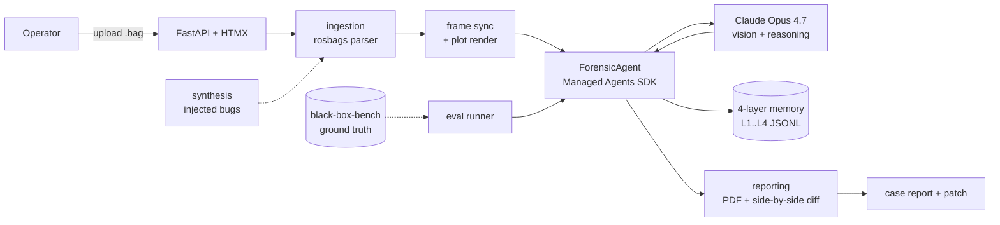
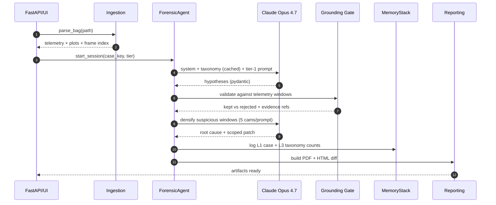
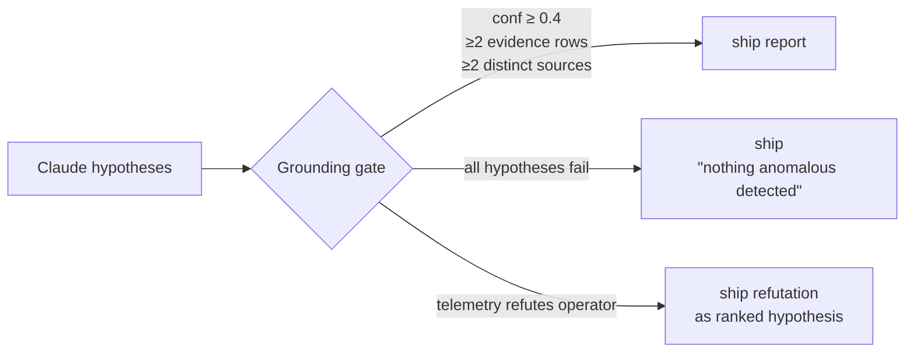
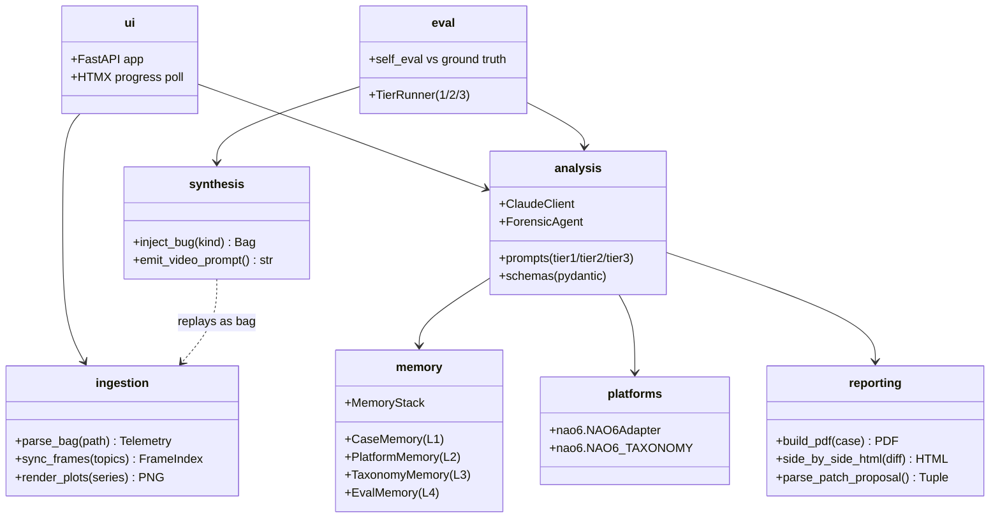
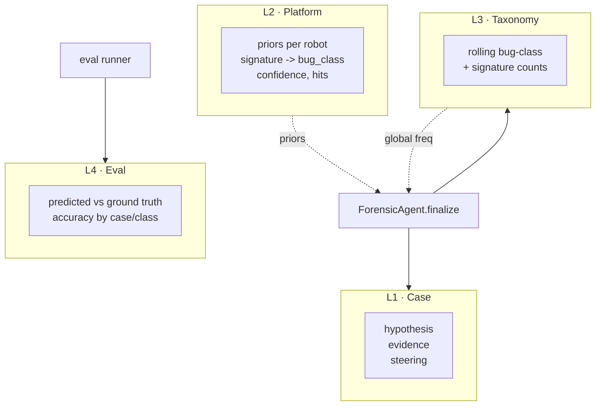
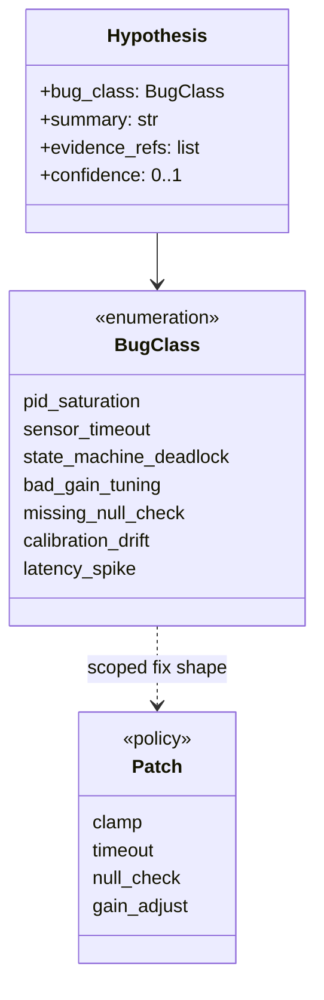
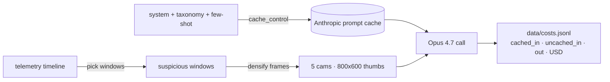

# Black Box

Forensic copilot for robots. Feed it a ROS bag, get back a root-cause hypothesis, cross-camera evidence, and a scoped code patch.

> **Pitch placeholder.** When a robot crashes, the flight data recorder tells you *what* happened. Black Box tells you *why* — and hands you the diff.

Built with **Claude Opus 4.7** (vision) + **Managed Agents** (long-horizon bag replay).

## Docs
- [Build journal & strategy](https://gist.github.com/LucasErcolano/851c5e976c6aa364f69c9e6875544061) — narrative, novelty positioning, findings.
- [Team onboarding](docs/ONBOARDING.md) — scope, cadence, conventions.
- [Pitch](docs/PITCH.md) — one-liner, elevator, positioning one-liners.
- [Demo script](docs/DEMO_SCRIPT.md) — 3-min video beat sheet.
- [Risks](docs/RISKS.md) — risk register + stop-loss triggers.
- [Submission](docs/SUBMISSION.md) — deliverables checklist.
- [Testimonial](docs/TESTIMONIAL.md) — quote capture plan.
- [Flag-plant](docs/FLAG_PLANT.md) — X/LinkedIn thread copy.
- [Rehearsal](docs/REHEARSAL.md) — pitch timing, breath points, Q&A prep.

## Modes
- **Forensic post-mortem** — crash bag in, root cause + patch out.
- **Scenario mining** — clean bag in, 3–5 moments of interest out.
- **Synthetic QA** — injected-bug bag in, hypothesis + self-eval vs ground truth out.

## Quickstart
```bash
python -m venv .venv && source .venv/bin/activate
pip install -e .
export ANTHROPIC_API_KEY=...    # or put in .env
python -m black_box.eval.runner --case data/synthetic/pid_saturation
```

## System overview

End-to-end flow from uploaded bag to NTSB-style report + unified diff.



## Analysis pipeline

The three tiers share one agent loop; the prompt template and the grounding gate change per tier.



## Grounding gate (two exits)

Every hypothesis Claude emits runs through a deterministic post-filter before it reaches the PDF. The gate has two visible exits — refuse the operator narrative, or ship silence — and both are in-tree as demo assets.



- **Refutation exit** — [`demo_assets/grounding_gate/README.md`](demo_assets/grounding_gate/README.md) — sanfer_tunnel: operator said "tunnel caused the anomaly," telemetry said RTK was already degraded 43 min pre-tunnel. The gate promoted the refutation to a ranked hypothesis with its own confidence and patch_hint.
- **Silence exit** — [`demo_assets/grounding_gate/clean_recording/README.md`](demo_assets/grounding_gate/clean_recording/README.md) — clean recording fed in, model produced four plausible-but-under-evidenced hypotheses, gate dropped all four (one per rule) and shipped `"No anomaly detected with sufficient evidence to support a scoped fix."`

Rules live in `src/black_box/analysis/grounding.py :: GroundingThresholds`. Regenerate the silence-exit fixture with `python scripts/build_grounding_gate_demo.py`.

## Package layout



## Memory stack (L1–L4)

Append-only JSONL, flat code, no vector DB. Each layer has a single narrow responsibility.



## Bug taxonomy (closed set)



Closed set (7): `pid_saturation`, `sensor_timeout`, `state_machine_deadlock`, `bad_gain_tuning`, `missing_null_check` (path planning), `calibration_drift` (cameras), `latency_spike` / sync issue.

## Token discipline



Escalate to 3.75 MP only on explicit request from the analysis step. Never 5 separate calls for 5 cameras — one cross-view prompt.

## Architecture (modules)
- `ingestion/` — `rosbags`-based ROS1+ROS2 parser, frame sync, matplotlib plots.
- `analysis/` — Claude client with aggressive prompt caching, 3 prompt templates, pydantic schemas, `ForensicAgent` over Managed Agents SDK.
- `memory/` — 4-layer append-only JSONL stack (case / platform / taxonomy / eval).
- `platforms/` — robot-specific adapters + taxonomies (NAO6 today).
- `synthesis/` — injects known bugs, emits ground truth + text video prompts (run Wan 2.2 / Nano Banana Pro yourself).
- `reporting/` — reportlab PDF (NTSB-style), unified diff + HTML side-by-side.
- `ui/` — FastAPI + HTMX progress polling.
- `eval/` — 3-tier runner.

## License
MIT.
