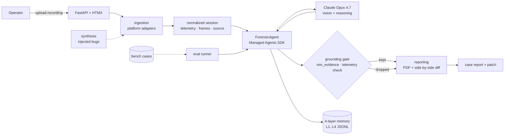
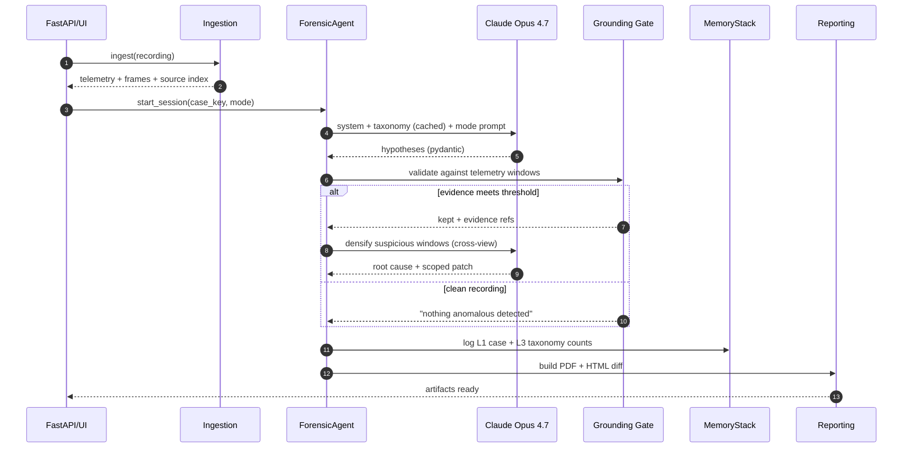
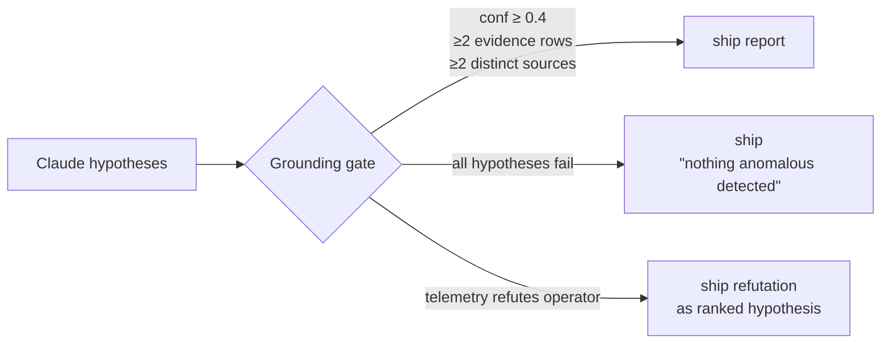
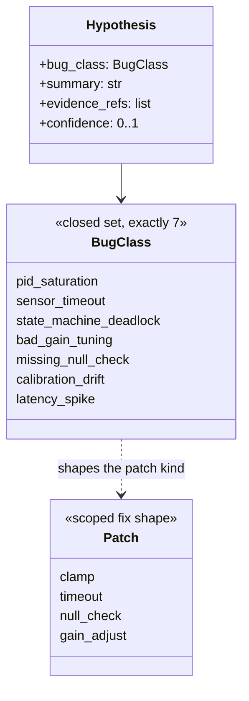
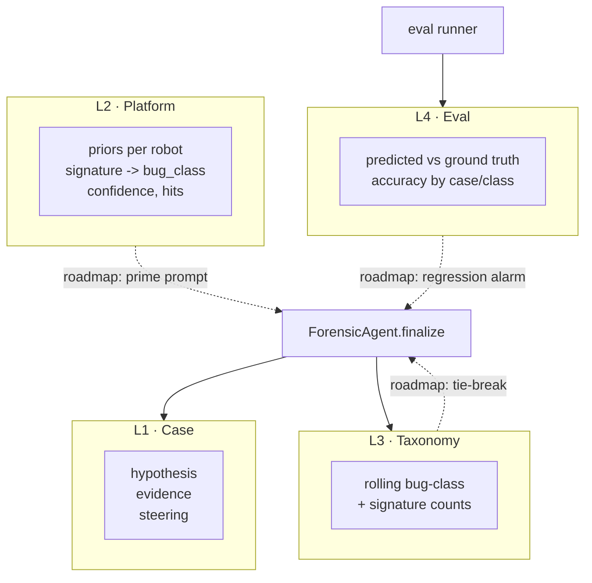
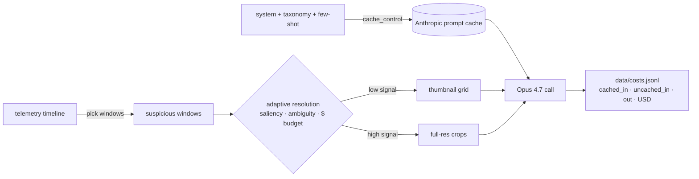
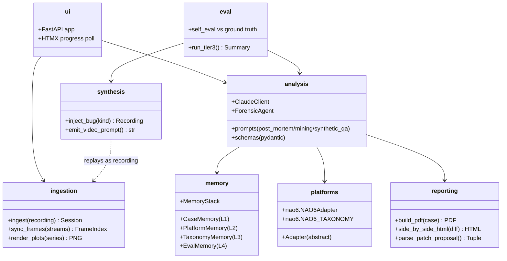

# Black Box — forensic copilot for robots

[](https://github.com/LucasErcolano/BlackBox/actions/workflows/ci.yml)
**Built with Claude Opus 4.7** · `claude-opus-4-7` · vision + reasoning + Managed Agents · no downgrades.

Feed it a robot recording — ROS1/ROS2 bag, telemetry, multi-camera video, LiDAR/IMU, plus repo context — and get back a grounded post-mortem: ranked root-cause hypotheses, timestamped multimodal evidence, an NTSB-style PDF, and a scoped code patch.

> When a robot crashes, the flight data recorder tells you *what* happened. Black Box tells you *why*, and hands you the diff.

---

## Table of contents

1. [Demo](#demo)
2. [Hero case — operator said "tunnel," telemetry said otherwise](#hero-case--operator-said-tunnel-telemetry-said-otherwise)
3. [Why this is hard](#why-this-is-hard)
4. [What we shipped](#what-we-shipped)
5. [How it works](#how-it-works)
6. [Grounding gate](#grounding-gate)
7. [Bug taxonomy — frozen 7](#bug-taxonomy--frozen-7)
8. [Memory stack](#memory-stack)
9. [Verification ledger — honest forensics](#verification-ledger--honest-forensics)
10. [Token discipline](#token-discipline)
11. [Benchmark](#benchmark)
12. [UI](#ui)
13. [Modes and trust tags](#modes-and-trust-tags)
14. [Capability matrix](#capability-matrix)
15. [Package layout](#package-layout)
16. [Demo asset catalog](#demo-asset-catalog)
17. [Bonus — NAO6 humanoid adapter](#bonus--nao6-humanoid-adapter)
18. [Docs](#docs)
19. [License](#license)

---

## Demo

▶ **[Watch the 3-min demo](https://github.com/LucasErcolano/BlackBox/blob/master/demo_assets/streaming/replay_sanfer_tunnel.mp4)** — full walkthrough of the hero case, the grounding gate refutation, and the scoped patch hand-off.

Try it locally in 60 seconds:

```bash
python -m venv .venv && source .venv/bin/activate
pip install -e .
export ANTHROPIC_API_KEY=...
python scripts/run_opus_bench.py --budget-usd 20    # writes data/bench_runs/opus47_<UTC>.json
```

Reference run committed for audit: [`data/bench_runs/opus47_20260423T140758Z.json`](data/bench_runs/opus47_20260423T140758Z.json) — **2 of 3 non-skeleton cases match on Opus 4.7 at $0.46 total spend**. Every benchmark number in this README traces back to that file.

Offline plumbing check (no API key, zero spend):

```bash
python -m black_box.eval.runner --tier 3 --case-dir black-box-bench/cases
```

Hero-case telemetry-only one-shot (no frames, no vision):

```bash
python scripts/run_rtk_heading_case.py     # requires ANTHROPIC_API_KEY
```

Full clean-clone reproducibility steps for judges: [`docs/SMOKE_TEST.md`](docs/SMOKE_TEST.md).

---

## Hero case — operator said "tunnel," telemetry said otherwise

`sanfer_sanisidro` RTK-heading break. Real operator recording. The operator tagged the bag *"tunnel caused the anomaly."* Black Box's grounding gate cross-checked telemetry, video, and source — and **refuted** the operator: RTK `carr_soln=none` was already present 43 minutes pre-tunnel, drive-by-wire never engaged, so the tunnel could not plausibly be the cause. The refutation ships as a ranked hypothesis with its own confidence and patch hint, not as agreement.

- Refutation narrative: [`demo_assets/grounding_gate/README.md`](demo_assets/grounding_gate/README.md) (tag: `replay`)
- Regenerate live: `python scripts/run_rtk_heading_case.py`
- Scope boundaries for the judged beat: [`SCOPE_FREEZE.md`](SCOPE_FREEZE.md)

---

## Why this is hard

Robotics failures are rarely obvious from one log or one operator's account. The hard part isn't summarizing logs — it's connecting partial, contradictory evidence (telemetry timestamps, camera frames, missing topics, source paths, system assumptions) into a defensible conclusion. Black Box is designed around that:

- Every hypothesis must anchor to **at least two independent sources**.
- Weakly-supported claims are **dropped** at the gate, not laundered into the report.
- The operator's narrative gets **no special weight** — telemetry can refute it.

---

## What we shipped

- **Long-horizon agentic investigation** built on Claude Managed Agents — ingest, sample windows, densify suspicious frames cross-camera, refute weak hypotheses, write the report, propose a scoped patch.
- **Deterministic grounding gate** (`src/black_box/analysis/grounding.py`) — every hypothesis needs ≥2 evidence rows from ≥2 distinct sources. Two visible exits: **refutation**, or `"nothing anomalous detected"`.
- **Frozen 7-class bug taxonomy** enforced at parse time by a Pydantic `Literal` — no silent label invention.
- **4-layer append-only memory stack** (case → platform → taxonomy → eval) plus Managed Agents native memory stores with a human-gated promotion ledger.
- **HITL approve/reject gate** before any patch is applied, plus a writable verification ledger so wrong calls can be challenged in place without rewriting history.
- **FastAPI + HTMX UI** with streaming reasoning, live operator steering (`POST /steer/{job_id}`), and time-travel rollback (`POST /checkpoints/{id}/rollback`).
- **Token discipline** — prompt caching on system + taxonomy + few-shot block, adaptive resolution budgeter, per-call cost ledger in `data/costs.jsonl`.

---

## How it works

Platform-agnostic by design: the analysis layer sees a normalized session (telemetry series, multi-view frames, source snapshots) regardless of source robot or recording format.



The three modes share one agent loop. The prompt template and the grounding gate change per mode; the memory writes are uniform.



---

## Grounding gate

The credibility floor. Every hypothesis Claude emits runs through a deterministic post-filter before it reaches the PDF — at least two evidence rows from two distinct sources, confidence ≥ 0.4. The gate has two visible exits, both shipped as in-tree demo assets.



- **Refutation exit** — [`demo_assets/grounding_gate/README.md`](demo_assets/grounding_gate/README.md). Sanfer hero case: operator narrative refuted, gate promoted the refutation to a ranked hypothesis with its own confidence and patch hint. Regenerate via `scripts/run_rtk_heading_case.py`.
- **Silence exit** — [`demo_assets/grounding_gate/clean_recording/README.md`](demo_assets/grounding_gate/clean_recording/README.md). Clean recording in, model produced four plausible-but-under-evidenced hypotheses, gate dropped all four (one per rule), shipped `"No anomaly detected with sufficient evidence to support a scoped fix."` Regenerate via `python scripts/build_grounding_gate_demo.py`.

Rules and thresholds live in `src/black_box/analysis/grounding.py :: GroundingThresholds`.

---

## Bug taxonomy — frozen 7

The taxonomy is **frozen at exactly 7 labels**. Schema enforcement lives in `src/black_box/analysis/schemas.py` as a Pydantic `Literal`; anything outside the set raises `ValidationError` at parse time. No silent coercion, no catch-all bucket. CLAUDE.md, the cached prompt block in `analysis/prompts.py`, and the benchmark scorer all mirror these strings verbatim.

```
pid_saturation
sensor_timeout
state_machine_deadlock
bad_gain_tuning
missing_null_check
calibration_drift
latency_spike
```



- A hypothesis scores iff `predicted == ground_truth` against one of the 7 labels.
- Patch shape stays one of the scoped primitives (clamp / timeout / null check / gain adjust).
- New failure modes are added via a deliberate schema bump (this block, the `Literal`, the cached prompt, and the scorer in the same PR), not by the model inventing a label at runtime.

---

## Memory stack

Black Box writes an append-only 4-layer JSONL store every run (no vector DB, no RAG). This is the **substrate**; the closed-loop policy that consumes L2 priors + L3 frequencies + L4 accuracy to steer the agent between runs is on the roadmap.



**Shipped:** stack wiring, Pydantic records, four independent stores, `MemoryStack.open()`, accuracy roll-ups by case and bug class, taxonomy counts on every finalize.

**Managed Agents native memory stores** are wired alongside the local stack. A shared read-only `bb-platform-priors` store mounts under `/mnt/memory/`; case-isolated read-write stores hold per-investigation state. Cross-case promotion is gated by a human verification ledger — agents propose, humans diff and approve. Wiring details: [`docs/MANAGED_AGENTS_MEMORY.md`](docs/MANAGED_AGENTS_MEMORY.md). Smoke harness: `python scripts/managed_memory_smoke.py --help`.

**Memory lifecycle CLI** (`blackbox-memory`, installed by `pyproject.toml`):

| Command | What it does |
|---|---|
| `audit-native --store NAME` | paths, last-modified, version count, sha256 |
| `export-native-versions --store NAME` | dumps version history to `data/memory_exports/<store_id>/` |
| `redact-native-version --version ID --reason TXT` | SDK redaction with required reason |
| `propose-promotion / diff-promotion / approve-promotion / reject-promotion` | human-gated promotion of agent-emitted candidates into `bb-platform-priors` |

Companion ops scripts under `scripts/`: `list_managed_memory_stores.py`, `archive_old_case_memory_stores.py` (dry-run by default), `delete_case_memory_store.py` (hard guard against `bb-platform-priors`), `export_memory_versions.py`.

**Roadmap:** the policy loop that reads L2 priors to bias the system prompt, uses L3 frequency as a tie-breaker on low-confidence hypotheses, and raises a regression alarm when L4 accuracy on a previously-solved case class drops below threshold. Calling that "self-improving" would be overclaim until the loop is visible between runs.

---

## Verification ledger — honest forensics

When the agent is wrong, history must not be silently rewritten. Every analysis carries a writable, append-only `verification_note.md` next to its L1 record where an operator records *"the agent concluded X, real cause was Y."* The original L1 entry is never edited; corrections are themselves new appended entries.

| Surface | Path |
|---|---|
| Per-analysis ledger | `data/reports/<job_id>/verification_note.md` |
| Cross-run structured ledger | `data/memory/verification.jsonl` |
| UI affordance | `POST /verify/{job_id}` (operator_id, agent_conclusion, real_cause, severity ∈ `dispute|correction|confirmation`) |
| Re-surfacing | `PolicyAdvisor.dispute_caveat_block()` raises the evidence bar on disputed classes |
| Tamper-evidence | module exposes no edit/delete API; `tests/test_verification_ledger.py` asserts append-only public surface |

This is the differentiator vs opaque automation: the agent's conclusions are auditable, and the audit is *writable* by the human in the loop.

---

## Token discipline

Image resolution is a **budget**, not a fixed dial. Every Claude call is logged to `data/costs.jsonl` (cached/uncached/creation tokens, USD, wall time, prompt kind).



- **System + taxonomy + few-shot** block is `cache_control`-tagged on every call.
- **Default tier** is a thumbnail grid across selected views in one cross-view prompt — never one call per camera.
- **Escalation** to full-resolution crops only when the analysis step explicitly asks; saliency, ambiguity, and remaining $ budget all gate the decision.
- **Reporting:** `python scripts/cost_report.py` summarizes the ledger; `--csv` exports CSV; `--chart docs/assets/cost_curve.png` regenerates the cumulative-spend curve.


---

## Benchmark

The benchmark lives in a sibling repo (`black-box-bench/`). Seven cases are present. Scoring requires exact match on `bug_class`.

**Reference run** (committed, `live`-regenerable): [`data/bench_runs/opus47_20260423T140758Z.json`](data/bench_runs/opus47_20260423T140758Z.json). Claude Opus 4.7, budget cap $20, actual spend **$0.46**, **2 of 3** non-skeleton cases match — `bad_gain_01` ✓, `pid_saturation_01` ✓, `sensor_timeout_01` ✗ (predicted `bad_gain_tuning`). Regenerate with `scripts/run_opus_bench.py`.

| Path | Cases | Offline stub | Real Opus 4.7 | Notes |
|---|---|---|---|---|
| `run_tier3(use_claude=False)` | 7 | runs (`live`) | — | deterministic plumbing check; does not call the model |
| `scripts/run_opus_bench.py` | 3 non-skeleton | — | **2/3 match · $0.46** (`live`) | reference run above |
| Tier-1 forensic batch runner | — | skeleton | skeleton | single-case path works end-to-end; batch CLI not yet wired |
| Tier-2 scenario-mining batch runner | — | skeleton | skeleton | agent loop exists; bench integration pending |
| Public-data path (`eval.public_data`) | — | stub | — | downloader + adapter mapping stubbed |

The published reference run in `black-box-bench/runs/sample/` is a hand-written reference (`sample`), not model output.

---

## UI

FastAPI + HTMX. NTSB aesthetic — no gradients, monospace reasoning stream, explicit job IDs.

<p>
  <br />
  <em>Upload — pick a recording, pick a mode, hand off to the worker.</em>
</p>

<p>
  <br />
  <em>Progress — staged reasoning stream (ingesting / analyzing / synthesizing / reporting). HTMX polls <code>/status/{job_id}</code> once per second.</em>
</p>

<p>
  <br />
  <em>Report — root cause, download link, and the "View proposed fix" side-by-side diff.</em>
</p>

The canonical worker behind the UI is **live** (ingestion → `ForensicAgent` session → PDF render). It runs whenever `ANTHROPIC_API_KEY` is set; no `BLACKBOX_REAL_PIPELINE` opt-in required. Source-mode selection at upload time (form field `source`, default `auto`):

| `source=` | Behavior |
|---|---|
| `auto` | Live when an API key is set; stub otherwise. |
| `live` | Force the real worker. 503 if the key is missing. |
| `stub` | Force the offline scripted walkthrough — used in the demo video for deterministic playback. |

If the live pipeline fails mid-run, the failure surfaces as a `failed` job with the error message — there is **no** silent stub fallback. `BLACKBOX_REAL_PIPELINE=0` remains as the kill-switch for offline-only environments.

Reproduce the screenshots: `python scripts/capture_screenshots.py` (requires `playwright` + `playwright install chromium`).

---

## Modes and trust tags

Three orthogonal axes describe any run:

| Axis | Values | Meaning |
|------|--------|---------|
| **Mode** | forensic post-mortem · scenario-mining · synthetic-QA | What question the pipeline is answering. |
| **Trust tag** | `live` · `replay` · `sample` | How an asset was produced. |
| **Tier** | 1 · 2 · 3 | Benchmark slice — known crashes (T1), clean bags (T2), injected bugs (T3). |

**Modes:**
- **Forensic post-mortem** — known-crash recording in, root cause + patch out.
- **Scenario mining** — clean recording in, 3–5 moments of interest out. Conservative: if nothing is found, the answer is `"nothing anomalous detected."`
- **Synthetic QA** — injected-bug recording in, hypothesis + self-eval vs ground truth out.

**Trust tags:**
- **`live`** — regenerated every run from committed code against committed inputs. No pre-baked outputs.
- **`replay`** — pre-computed artifact committed in-tree so the demo video is deterministic. Regeneration path is committed alongside.
- **`sample`** — static reference material authored by hand (not model output).

The trust tag and the mode are independent: a `live` run can be in any mode, a `replay` artifact can illustrate any mode.

---

## Capability matrix

Every claim in this README ties to one of three states.

| State | Meaning |
|-------|---------|
| ✅ Shipped | Reachable from the canonical demo path, exercised by tests. |
| 🟡 Partial | Code path exists, gated behind `BLACKBOX_REAL_PIPELINE=1` env or a single-case CLI; not the canonical UI flow yet. |
| 🛣 Roadmap | Tracked as an open issue. Not on the judged beat. |

<details>
<summary><strong>Full capability table (click to expand)</strong></summary>

| Capability | State | File pointer | Tracking |
|------------|-------|--------------|----------|
| Session discovery (folder → bag bundles) | ✅ | `src/black_box/ingestion/session.py::discover_session_assets` | — |
| `rosbags`-based ROS1+ROS2 reader | ✅ | `src/black_box/ingestion/` | — |
| Telemetry-anchored frame sampling (`from_timeline` + `sample_frames`) | ✅ | `analysis/windows.py`, `ingestion/frame_sampler.py` | — |
| `ClaudeClient` with prompt caching, cost ledger | ✅ | `analysis/client.py`, `data/costs.jsonl` | #89 |
| `prompts_v2` / `prompts_generic` / `prompts_boat` templates | ✅ | `src/black_box/analysis/prompts*.py` | — |
| `ForensicAgent` over Managed Agents SDK | ✅ | `analysis/managed_agent.py` | — |
| Grounding gate (refute / silence) | ✅ | `analysis/grounding.py` | #77 |
| PDF + diff HTML reporting | ✅ | `reporting/` | — |
| Memory L1–L4 substrate (append-only JSONL) | ✅ | `memory/` | — |
| Memory self-improving loop demo | ✅ | `scripts/memory_loop_demo.py`, `memory/` | — |
| Memory pruning + compaction (L1–L3) | ✅ | `memory/maintenance.py` | — |
| Verification ledger + decisions / patch-not-applied | ✅ | `memory/verification.py`, `memory/decisions.py` | — |
| FastAPI + HTMX UI (upload → progress → diff) | ✅ | `src/black_box/ui/` | — |
| Real pipeline as canonical UI worker | ✅ | live default; stub via `?source=stub` | — |
| HITL approve/reject persistence + no-auto-apply gate | ✅ | `memory/decisions.py`, UI banner | — |
| Live steering (`POST /steer/{job_id}`) | ✅ | UI button + JSONL audit | — |
| Async/long-running batch worker | ✅ | `scripts/overnight_batch.py` (resume + cost cap) | — |
| Time-travel rollback UI (checkpoints + fork) | ✅ | `POST /checkpoints/{id}/rollback` | — |
| Glass-box evidence trace (citations, replayable) | ✅ | `GET /trace/{job_id}` | — |
| Tier-3 case runner | ✅ | `eval/runner.py` | — |
| Tier-1 / Tier-2 batch runners + markdown table | ✅ | `eval/runner.py`, `scripts/overnight_batch.py` | — |
| Public-data downloader path | ✅ | `eval/public_data.py` | — |
| `visual_mining_v2` enabled for hero cases | ✅ | per-tier mapping | — |
| Asciinema of unattended live batch | ✅ | `docs/recordings/offline_batch.cast` | — |
| Network-isolated sandbox default (`network=none`) | ✅ | `security/sandbox.py`, `SECURITY.md` | — |
| Credential vault (capabilities, not secrets) | ✅ | `security/vault.py` | — |
| HTTP-Basic auth gate on mutating routes (off by default) | ✅ | `security/auth.py` | — |
| Prompt-injection role segregation | ✅ | adversarial regression in `tests/` | — |
| Visual PII redaction + path-traversal sandbox | ✅ | `security/redact.py`, `security/sandbox.py` | — |
| Context hygiene (tool_search, programmatic calls, context editing) | ✅ | `analysis/context_hygiene.py` | — |
| `scripts/` taxonomy split (eval/demo/ops/dev) | ✅ | `scripts/README.md` | — |
| pytest-cov gates + reproducible release packaging | ✅ | `.github/workflows/ci.yml`, release tag flow | — |
| NAO6 platform adapter (synthetic fixture only) | ✅ | `src/black_box/platforms/nao6/` | — |

</details>

---

## Package layout



| Module | Responsibility |
|---|---|
| `ingestion/` | Recording parser (`rosbags` for ROS1+ROS2, pure Python — no ROS runtime), frame sync, plot rendering. |
| `analysis/` | `ClaudeClient` with aggressive prompt caching, three prompt templates, Pydantic schemas, `ForensicAgent` over Managed Agents SDK. |
| `memory/` | 4-layer append-only JSONL stack (case / platform / taxonomy / eval) + Managed Agents native stores. |
| `platforms/` | Robot-specific adapters + taxonomies. |
| `synthesis/` | Injected-bug recordings + text video prompts. Video generation is operator-driven on your own GPU; nothing is auto-installed. |
| `reporting/` | reportlab PDF (NTSB-style), unified diff + HTML side-by-side. |
| `ui/` | FastAPI + HTMX progress polling. Live worker is canonical; `?source=stub` opt-in for the offline demo. |
| `eval/` | Tier-3 runner + offline stub path; Tier-1/Tier-2 batch runners pending. |
| `scripts/` | Runners, demo asset builders, ops, dev utilities. Categorized in [`scripts/README.md`](scripts/README.md). |

---

## Demo asset catalog

Primary mapping: [`demo_assets/INDEX.md`](demo_assets/INDEX.md). Tags per beat:

- `demo_assets/streaming/replay_sanfer_tunnel.mp4` — `replay` (regen via `scripts/record_replay.py` + `scripts/record_replay_raw.py`)
- `demo_assets/pdfs/sanfer_tunnel.pdf` + `pdfs/sanfer_tunnel/page-*.png` — `replay` (regen via `scripts/run_session.py` → `scripts/regen_reports_md.py`)
- `demo_assets/pdfs/boat_lidar.pdf`, `demo_assets/pdfs/car_1.pdf` — `replay`
- `demo_assets/analyses/{sanfer_tunnel,boat_lidar,car_1}.json` — `replay` (committed model output; hero-case regen via `scripts/run_rtk_heading_case.py` is `live`)
- `demo_assets/analyses/TOP_FINDINGS.md` — `sample` (hand-written overview table)
- `demo_assets/grounding_gate/README.md` — `replay` (refutation narrative; underlying analysis is regenerable `live`)
- `demo_assets/grounding_gate/clean_recording/` — `replay` (regen via `scripts/build_grounding_gate_demo.py` is `live`)
- `demo_assets/diff_viewer/moving_base_rover.{html,png}` — `replay` (regen via `scripts/render_rtk_diff.py`)
- `demo_assets/memory_snapshot/L{1,3}*` — `replay` (captured from a real run; store is `live`-appended by every `ForensicAgent.finalize`)
- `demo_assets/streams/*.jsonl` — `replay` (telemetry event streams from real ingestion)
- `demo_assets/bag_footage/` — `replay` (camera frames extracted from real bags; `scripts/extract_*`)
- `bench/cases.yaml` + `bench/fixtures/` — `sample` (hand-authored fixtures for the offline plumbing path)
- `black-box-bench/cases/` — `live` (real telemetry inputs for the budgeted Opus 4.7 pass)
- `black-box-bench/runs/sample/` — `sample` (hand-written reference run, explicitly labeled)

---

## Bonus — NAO6 humanoid adapter

> Not on the judged demo critical path. The hero case is rover/marine; NAO6 ships as a bonus adapter to prove the platform-adapter shape generalizes. See [`SCOPE_FREEZE.md`](SCOPE_FREEZE.md).

`platforms/nao6/` includes:
- an ingestion adapter for NAO6 (SoftBank Aldebaran) humanoid recordings,
- a synthetic fall fixture (`sample`) for end-to-end smoke testing,
- a platform-specific taxonomy that maps onto the global closed-set `BugClass`,
- controller snapshots for Tier-3 injected-bug reproduction.

Regeneration and capture helpers: `scripts/capture_nao6.py`, `scripts/NAO6_CAPTURE_GUIDE.md`.

---

## Docs

- [Project rules (`CLAUDE.md`)](CLAUDE.md) — hackathon hard rules, project shape, token discipline.
- [Smoke test for judges](docs/SMOKE_TEST.md) — clean-clone reproducibility steps.
- [Memory stack composition + cost-delta proof](docs/MEMORY_STACK.md) — L1–L4 stack, verification_note, grounding gate, caching math.
- [Managed Agents memory wiring](docs/MANAGED_AGENTS_MEMORY.md) — native stores + promotion ledger.
- [Demo script](docs/DEMO_SCRIPT.md) — 3-min video beat sheet.
- [Pitch](docs/PITCH.md) — one-liner, elevator, positioning.
- [Build journal](https://gist.github.com/LucasErcolano/851c5e976c6aa364f69c9e6875544061) — narrative, novelty, findings.
- [Overnight batch](OVERNIGHT_BATCH.md) — unattended bench runner + budget-gated driver. Dry-run log: [`docs/assets/overnight_batch_dryrun.txt`](docs/assets/overnight_batch_dryrun.txt). Asciicast: [`docs/recordings/offline_batch.cast`](docs/recordings/offline_batch.cast).

---

## License

MIT.
