# Black Box

[](https://github.com/LucasErcolano/BlackBox/actions/workflows/ci.yml)

**Built with Claude Opus 4.7** — vision + reasoning + Managed Agents (long-horizon session replay). Model ID: `claude-opus-4-7`. No downgrades.

Forensic copilot for robots. Feed it a robot recording, get back a root-cause hypothesis, cross-modal evidence, and a scoped code patch.

> When a robot crashes, the flight data recorder tells you *what* happened. Black Box tells you *why*, and hands you the diff.

## Hero case

The one finding the demo is built around: **`sanfer_sanisidro` RTK-heading break.** Real operator recording. Operator tagged the bag "tunnel caused the anomaly." Black Box's grounding gate promoted a ranked **refutation**: RTK `carr_soln=none` was already present 43 min pre-tunnel, DBW never engaged, so the tunnel could not have caused the reported behavior change. Proof: [`demo_assets/grounding_gate/README.md`](demo_assets/grounding_gate/README.md) (tag: `replay`). Scope boundaries: [`SCOPE_FREEZE.md`](SCOPE_FREEZE.md).

## What is live vs replay

Every asset mentioned in this README and in the demo script carries one of three tags. Judges should treat them as different trust levels.

- **`live`** — regenerated every run from committed code against committed inputs. No pre-baked outputs. Example: `scripts/run_opus_bench.py` producing a fresh `data/bench_runs/*.json`.
- **`replay`** — pre-computed artifact committed in-tree so the demo video is deterministic and cheap. Regeneration path is committed and documented alongside the asset. Example: the sanfer PDF and streaming mp4.
- **`sample`** — static reference material authored by hand (not model output). Labeled as such wherever it appears. Example: `black-box-bench/runs/sample/`.

One E2E command that works from a clean checkout (installs + runs the budgeted bench pass that produced the committed numbers below):

```bash
python -m venv .venv && source .venv/bin/activate
pip install -e .
export ANTHROPIC_API_KEY=...
python scripts/run_opus_bench.py --budget-usd 20
```

This writes a fresh `data/bench_runs/opus47_<UTC>.json`. The reference run is [`data/bench_runs/opus47_20260423T140758Z.json`](data/bench_runs/opus47_20260423T140758Z.json) (tag: `live` — regenerable; committed for audit): **2 of 3 non-skeleton cases match on Opus 4.7 at $0.46 total**, no skeleton-case padding. Every benchmark number in this README traces back to that file.

Offline plumbing check that does not call the model:

```bash
python -m black_box.eval.runner --case-dir black-box-bench/cases   # tag: live
```

Hero-case telemetry-only one-shot (no frames, no vision):

```bash
python scripts/run_rtk_heading_case.py   # tag: live, requires ANTHROPIC_API_KEY
```

## Docs
- [Project rules (`CLAUDE.md`)](CLAUDE.md) — hackathon hard rules, project shape, token discipline. Read this first.
- [Build journal & strategy](https://gist.github.com/LucasErcolano/851c5e976c6aa364f69c9e6875544061) — narrative, novelty positioning, findings.
- [Memory stack composition + cost-delta proof](docs/MEMORY_STACK.md) — L1-L4 stack, verification_note, grounding gate, caching math.
- [Team onboarding](docs/ONBOARDING.md) — scope, cadence, conventions.
- [Pitch](docs/PITCH.md) — one-liner, elevator, positioning one-liners.
- [Demo script](docs/DEMO_SCRIPT.md) — 3-min video beat sheet.
- [Risks](docs/RISKS.md) — risk register + stop-loss triggers.
- [Submission](docs/SUBMISSION.md) — deliverables checklist.
- [Testimonial](docs/TESTIMONIAL.md) — quote capture plan.
- [Flag-plant](docs/FLAG_PLANT.md) — X/LinkedIn thread copy.
- [Rehearsal](docs/REHEARSAL.md) — pitch timing, breath points, Q&A prep.
- [Overnight batch](OVERNIGHT_BATCH.md) — unattended bench runner + budget-gated driver for `scripts/overnight_batch.py`. Dry-run log at [`docs/assets/overnight_batch_dryrun.txt`](docs/assets/overnight_batch_dryrun.txt); live asciinema cast is a followup.

## Token discipline

Every Claude call is logged to `data/costs.jsonl` (cached/uncached/creation tokens, USD, wall time, prompt kind). Summarize with `python scripts/cost_report.py`; export CSV with `--csv`; regenerate the cumulative-spend curve with `--chart docs/assets/cost_curve.png`.

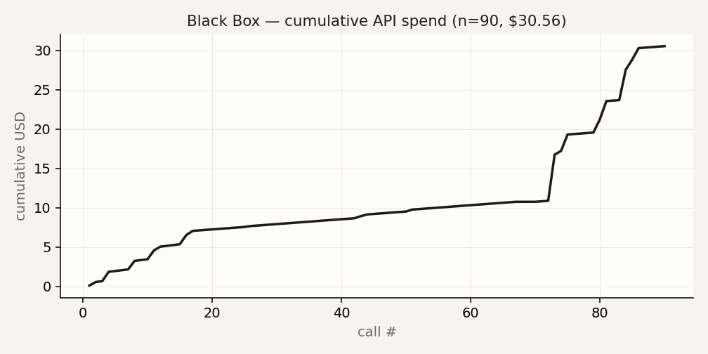

## Modes
- **Forensic post-mortem** — known-crash recording in, root cause + patch out.
- **Scenario mining** — clean recording in, 3–5 moments of interest out. Conservative: if nothing is found, the answer is "nothing anomalous detected."
- **Synthetic QA** — injected-bug recording in, hypothesis + self-eval vs ground truth out.

## Quickstart
```bash
python -m venv .venv && source .venv/bin/activate
pip install -e .
export ANTHROPIC_API_KEY=...    # or put in .env
python -m black_box.eval.runner --case-dir black-box-bench/cases
```

Verified on this commit (2026-04-23, Python 3.13.9):

- `pytest -q` -> **169 passed** in 20.65s (2 deprecation warnings, no failures).
- `python scripts/cost_report.py` -> **TOTAL $30.56** across 90 entries (29 real Opus 4.7 calls: $26.97; 61 test fixtures: $3.59).
- `lychee README.md` -> **11/11 links OK, 0 errors** (enforced in CI via `.github/workflows/link-check.yml`).

## System overview

Platform-agnostic by design: the analysis layer sees a normalized session (telemetry series, multi-view frames, source snapshots) regardless of the source robot or recording format.

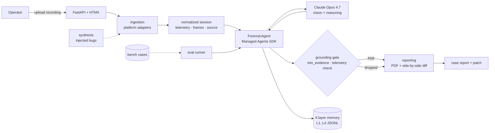

## Analysis pipeline

The three modes share one agent loop. The prompt template and the grounding gate change per mode; the memory writes are uniform.

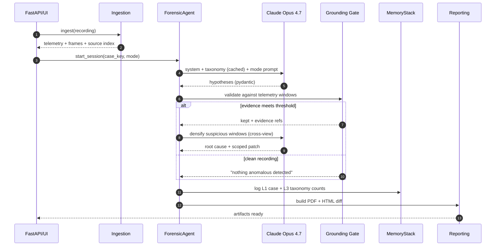

## Grounding gate (two exits)

Every hypothesis Claude emits runs through a deterministic post-filter before it reaches the PDF. The gate has two visible exits — refuse the operator narrative, or ship silence — and both are in-tree as demo assets.

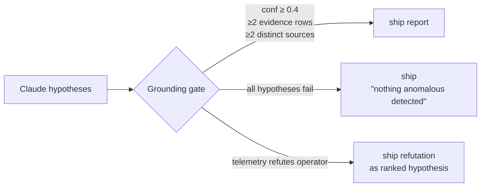

- **Refutation exit** (`replay`) — [`demo_assets/grounding_gate/README.md`](demo_assets/grounding_gate/README.md) — sanfer_tunnel: operator said "tunnel caused the anomaly," telemetry said RTK was already degraded 43 min pre-tunnel. The gate promoted the refutation to a ranked hypothesis with its own confidence and patch_hint. Regenerate via `scripts/run_rtk_heading_case.py` (`live`).
- **Silence exit** (`replay`) — [`demo_assets/grounding_gate/clean_recording/README.md`](demo_assets/grounding_gate/clean_recording/README.md) — clean recording fed in, model produced four plausible-but-under-evidenced hypotheses, gate dropped all four (one per rule) and shipped `"No anomaly detected with sufficient evidence to support a scoped fix."` Regenerate via `python scripts/build_grounding_gate_demo.py` (`live`).

Rules live in `src/black_box/analysis/grounding.py :: GroundingThresholds`. Regenerate the silence-exit fixture with `python scripts/build_grounding_gate_demo.py`.

## Package layout

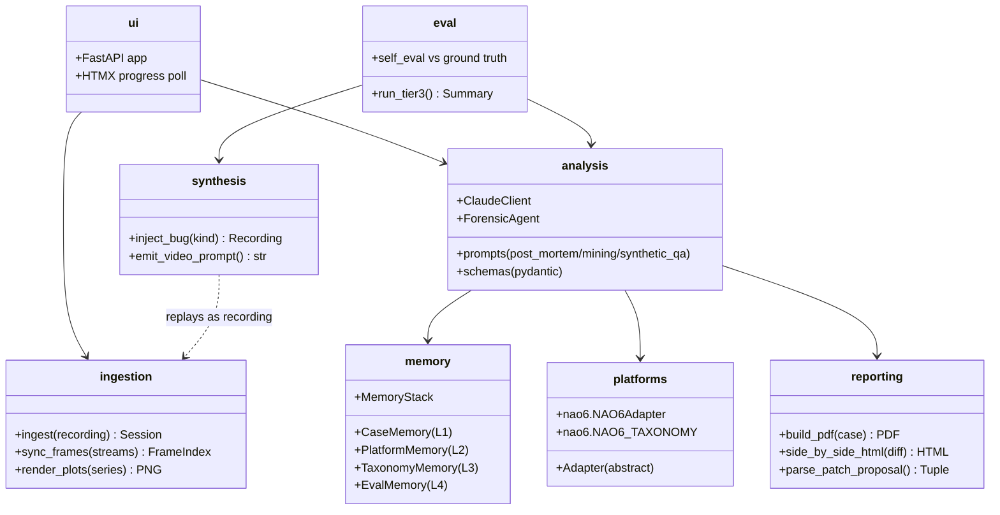

## Bug taxonomy — closed set of 7 (frozen)

The taxonomy is **frozen at exactly 7 labels**. Schema enforcement lives in
`src/black_box/analysis/schemas.py` as a Pydantic `Literal`; anything outside
the set raises `ValidationError` at parse time — no silent coercion, no
catch-all bucket. This block is the source of truth; CLAUDE.md, the cached
prompt block in `src/black_box/analysis/prompts.py`, and the benchmark scorer
all mirror these exact strings verbatim.

```
pid_saturation
sensor_timeout
state_machine_deadlock
bad_gain_tuning
missing_null_check
calibration_drift
latency_spike
```

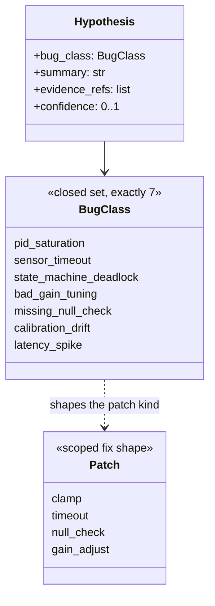

- A hypothesis scores iff `predicted == ground_truth` against one of the 7 labels.
- Patch shape stays one of the scoped primitives (clamp / timeout / null check / gain adjust).
- New failure modes get promoted into the taxonomy via a deliberate schema bump (updating this block, the `Literal`, the cached prompt, and the scorer in the same PR), not by the model inventing a label at runtime.

## Memory stack — substrate today, self-improving loop on the roadmap

Black Box writes an append-only 4-layer JSONL store every run (no vector DB, no RAG). This is the **substrate** for self-improvement. The visible policy loop that consumes L2 priors + L3 frequencies + L4 accuracy to steer the agent between runs is not yet convincingly surfaced in the demo — it's the next piece.

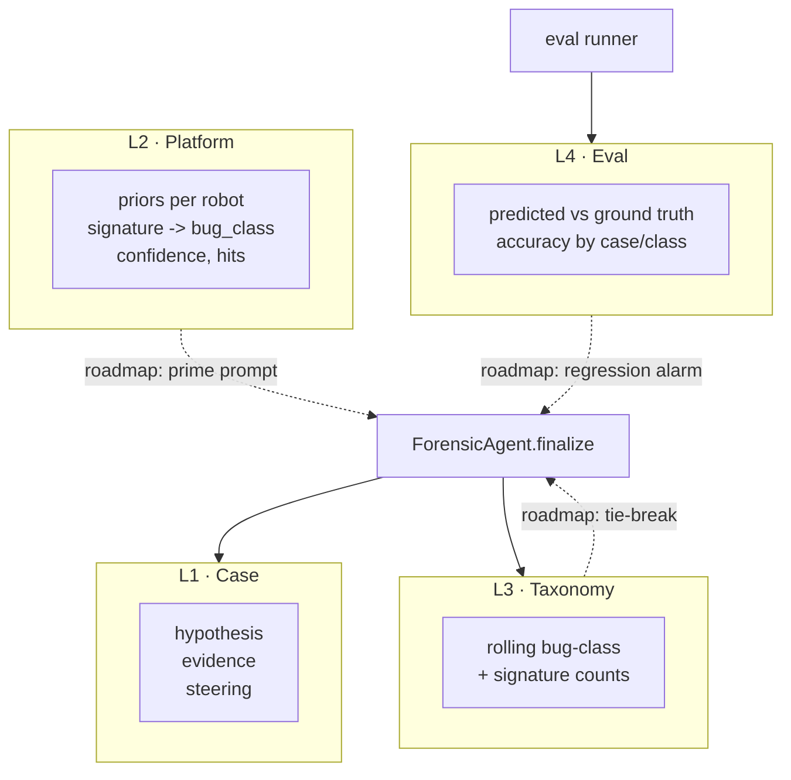

**Shipped:** stack wiring, pydantic records, four independent stores, `MemoryStack.open()`, accuracy roll-ups by case and bug class, taxonomy counts on every finalize.

**Not yet shipped (roadmap):** the policy loop that reads L2 priors to bias the system prompt, uses L3 frequency as a tie-breaker on low-confidence hypotheses, and raises a regression alarm when L4 accuracy on a previously-solved case class drops below a threshold. Calling that "self-improving" would be overclaim until the loop is visible between runs.

## Grounding gate

The gate is the credibility floor: every hypothesis must anchor to at least two sources (telemetry window + frame evidence, or telemetry + source snippet). A clean recording returns `"nothing anomalous detected"` by construction — the gate is why Black Box doesn't hallucinate on calm bags.

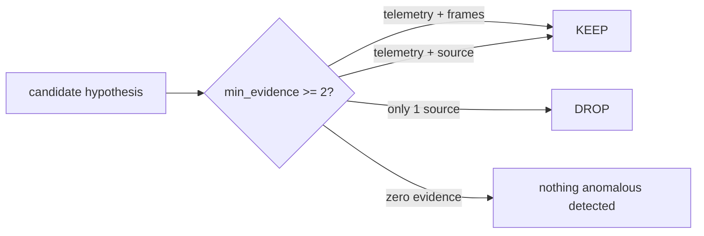

## Adaptive resolution budgeter

Image resolution is not a fixed dial — it's a budget. The frame sampler chooses resolution per window based on:

- **Saliency** — is this a flagged telemetry spike or a quiet stretch?
- **Ambiguity** — did the last Claude call return low confidence or conflicting hypotheses?
- **Cost budget** — remaining per-case token budget against a $500 hackathon cap.

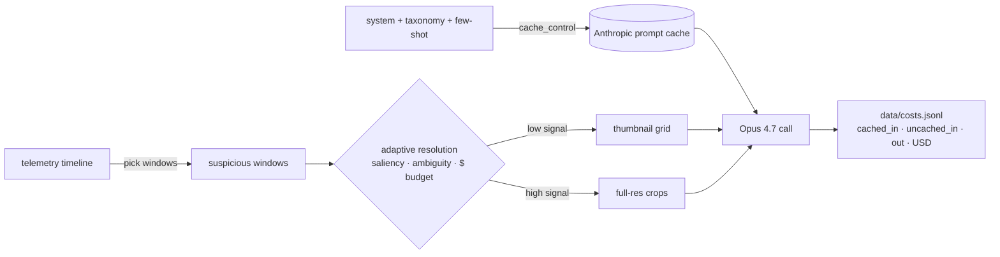

Default tier is a thumbnail grid across the selected views in one cross-view prompt — **never** one call per camera. The budgeter escalates to full-resolution crops only when the analysis step explicitly asks.

## Benchmark status

The benchmark lives in a sibling repo (`black-box-bench/`). Seven cases are present. Scoring requires exact match on `bug_class`.

**Reference run (committed, `live`-regenerable):** [`data/bench_runs/opus47_20260423T140758Z.json`](data/bench_runs/opus47_20260423T140758Z.json). Claude Opus 4.7, budget cap $20, actual spend **$0.46**, **2 of 3** non-skeleton cases match (`bad_gain_01` ✓, `pid_saturation_01` ✓, `sensor_timeout_01` ✗ — predicted `bad_gain_tuning`). Regenerate with `scripts/run_opus_bench.py`.

| Path | Cases | Offline stub | Real Opus 4.7 | Notes |
|---|---|---|---|---|
| `run_tier3(use_claude=False)` | 7 | runs (`live`) | — | deterministic plumbing check; does not call the model |
| `scripts/run_opus_bench.py` | 3 non-skeleton | — | **2/3 match · $0.46** (`live`) | see reference run above |
| Tier-1 forensic batch runner | — | skeleton | skeleton | single-case path works end-to-end; batch CLI not yet wired |
| Tier-2 scenario-mining batch runner | — | skeleton | skeleton | agent loop exists; bench integration pending |
| Public-data path (`eval.public_data`) | — | stub | — | downloader + adapter mapping stubbed |

The published reference run in `black-box-bench/runs/sample/` is a hand-written reference (`sample`), not model output.

## UI

Three states of the FastAPI + HTMX front-end running against synthetic fixtures. NTSB aesthetic — no gradients, monospace reasoning stream, explicit job IDs.

<p>
  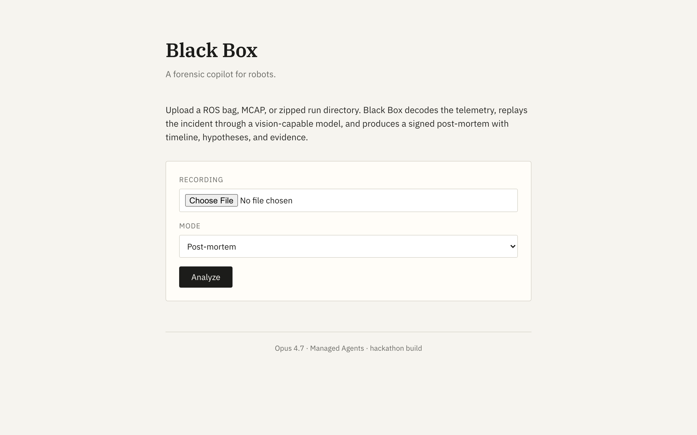<br />
  <em>Upload — pick a recording, pick a mode, hand off to the worker.</em>
</p>

<p>
  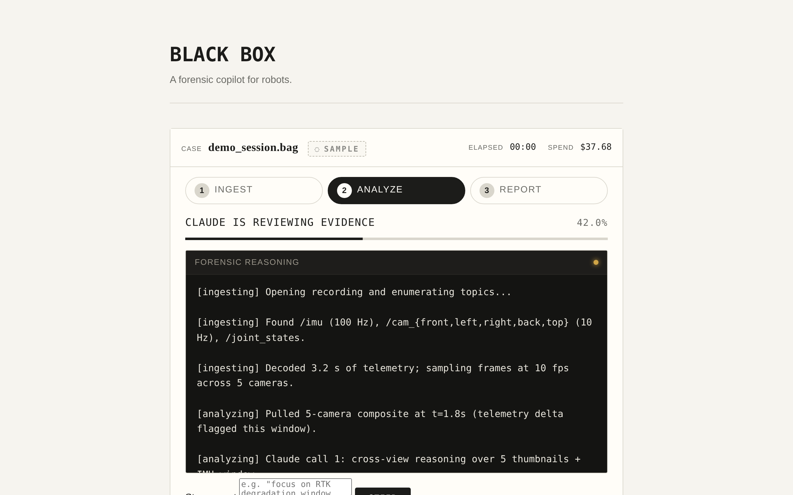<br />
  <em>Progress — staged reasoning stream (ingesting / analyzing / synthesizing / reporting), HTMX polls <code>/status/{job_id}</code> once per second.</em>
</p>

<p>
  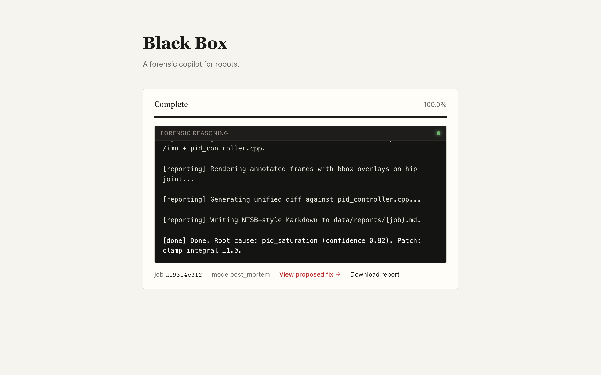<br />
  <em>Report — complete state with root cause, download link, and the "View proposed fix" side-by-side diff.</em>
</p>

Reproduce: `python scripts/capture_screenshots.py` (requires `playwright` + `playwright install chromium`).

## UI status

`src/black_box/ui/` ships the upload → streaming-reasoning → side-by-side-diff UX. Behind the UI, the pipeline worker is currently the streaming **stub** (`_run_pipeline_stub` in `ui/app.py`) that walks through realistic stage chunks and emits a canned patch artifact for the diff viewer (tag: `replay`). The demo video uses this path.

The real worker (ingestion → `ForensicAgent` session → PDF render) runs today via `scripts/managed_agent_smoke.py` (tag: `live`, gated on `BLACKBOX_REAL_PIPELINE=1`); wiring that into the UI background task is deferred — see [`SCOPE_FREEZE.md`](SCOPE_FREEZE.md).

## Demo asset catalog

Primary mapping: [`demo_assets/INDEX.md`](demo_assets/INDEX.md). Tags per beat:

- `demo_assets/streaming/replay_sanfer_tunnel.mp4` — `replay` (pre-recorded UI walkthrough; regen via `scripts/record_replay.py` + `scripts/record_replay_raw.py`)
- `demo_assets/pdfs/sanfer_tunnel.pdf` + `pdfs/sanfer_tunnel/page-*.png` — `replay` (regen via `scripts/run_session.py` → `scripts/regen_reports_md.py`)
- `demo_assets/pdfs/boat_lidar.pdf`, `demo_assets/pdfs/car_1.pdf` — `replay`
- `demo_assets/analyses/sanfer_tunnel.json`, `boat_lidar.json`, `car_1.json` — `replay` (committed model output; hero-case regen via `scripts/run_rtk_heading_case.py` which is `live`)
- `demo_assets/analyses/TOP_FINDINGS.md` — `sample` (hand-written overview table)
- `demo_assets/grounding_gate/README.md` — `replay` (refutation narrative; underlying analysis is `replay`, regenerable `live`)
- `demo_assets/grounding_gate/clean_recording/` — `replay` (fixture; regen via `scripts/build_grounding_gate_demo.py` is `live`)
- `demo_assets/diff_viewer/moving_base_rover.{html,png}` — `replay` (regen via `scripts/render_rtk_diff.py`)
- `demo_assets/memory_snapshot/L{1,3}*` — `replay` (captured from a real run; store is `live`-appended by every `ForensicAgent.finalize`)
- `demo_assets/streams/*.jsonl` — `replay` (telemetry event streams captured from real ingestion)
- `demo_assets/bag_footage/` — `replay` (camera frames extracted from real bags; scripts under `scripts/extract_*`)
- `bench/cases.yaml` + `bench/fixtures/` — `sample` (hand-authored fixtures for the offline plumbing path)
- `black-box-bench/cases/` — `live` (real telemetry inputs used by the budgeted Opus 4.7 pass)
- `black-box-bench/runs/sample/` — `sample` (hand-written reference run, explicitly labeled)

## Implementation notes (current adapters)

- **Ingestion** — `rosbags` for ROS1+ROS2 bag files (pure Python, no ROS runtime). Other adapters plug in under `platforms/`.
- **Synthesis** — emits telemetry + buggy controllers + text video prompts. Video generation (Wan 2.2 / Nano Banana Pro) is operator-driven on your own GPU; nothing is auto-installed.

## Architecture (modules)
- `ingestion/` — recording parser, frame sync, plot rendering.
- `analysis/` — Claude client with aggressive prompt caching, three prompt templates, pydantic schemas, `ForensicAgent` over Managed Agents SDK.
- `memory/` — 4-layer append-only JSONL stack (case / platform / taxonomy / eval).
- `platforms/` — robot-specific adapters + taxonomies (see **Bonus** below).
- `synthesis/` — injected-bug recordings + text video prompts.
- `reporting/` — reportlab PDF (NTSB-style), unified diff + HTML side-by-side.
- `ui/` — FastAPI + HTMX progress polling (stub worker today; real wiring deferred per `SCOPE_FREEZE.md`).
- `eval/` — tier-3 runner + offline stub path; tier-1/tier-2 batch runners pending.

## Bonus — NAO6 humanoid adapter (not on the demo critical path)

> **Scope note.** The primary pitch above and the demo hero case are rover / marine. NAO6 is shipped as a bonus adapter to prove the platform-adapter shape generalizes. It is **not** part of the judged demo beat. See [`SCOPE_FREEZE.md`](SCOPE_FREEZE.md).

`platforms/nao6/` includes:
- an ingestion adapter for NAO6 (SoftBank Aldebaran) humanoid recordings,
- a synthetic fall fixture (`sample`) for end-to-end smoke testing,
- a platform-specific taxonomy that maps onto the global closed-set `BugClass`,
- controller snapshots for Tier-3 injected-bug reproduction.

Regeneration and capture helpers live under `scripts/capture_nao6.py` and `scripts/NAO6_CAPTURE_GUIDE.md`.

## License
MIT.
