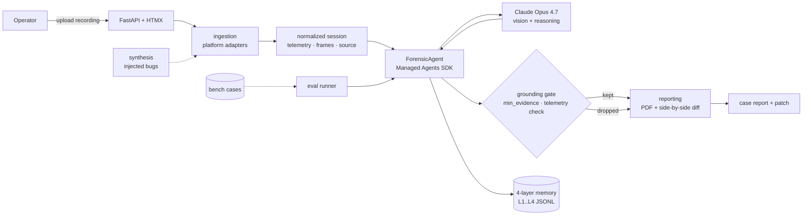
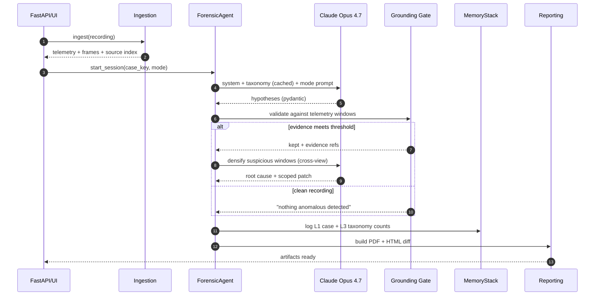
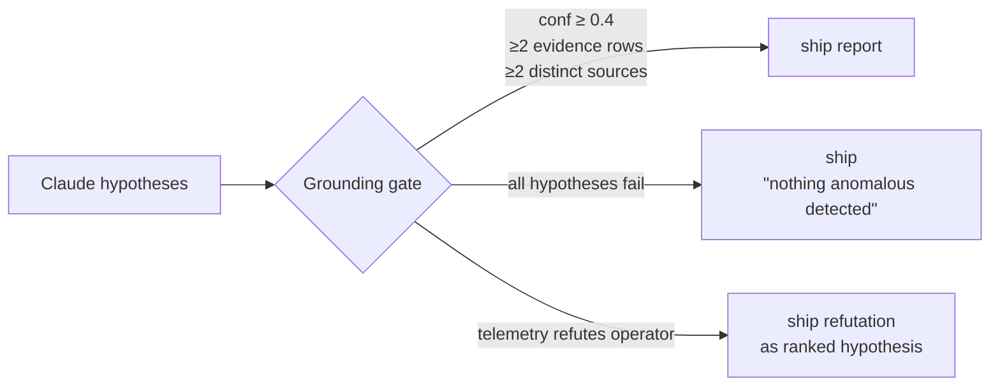
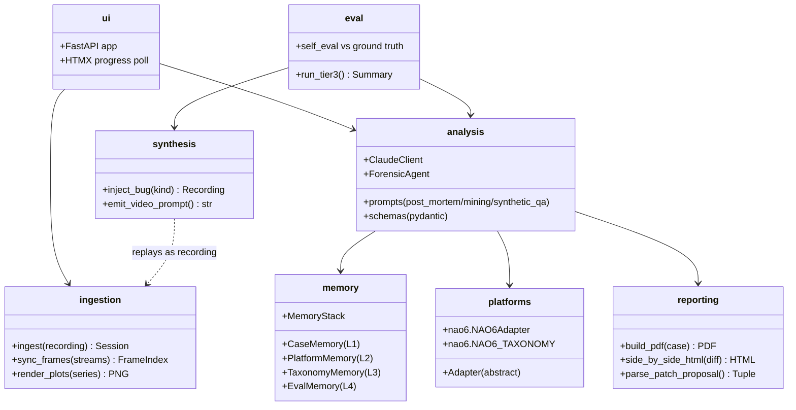
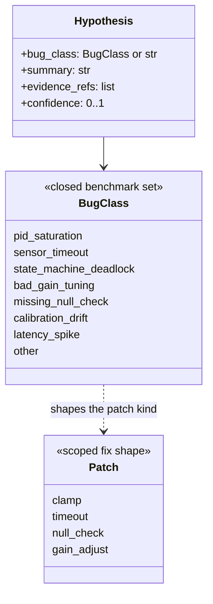
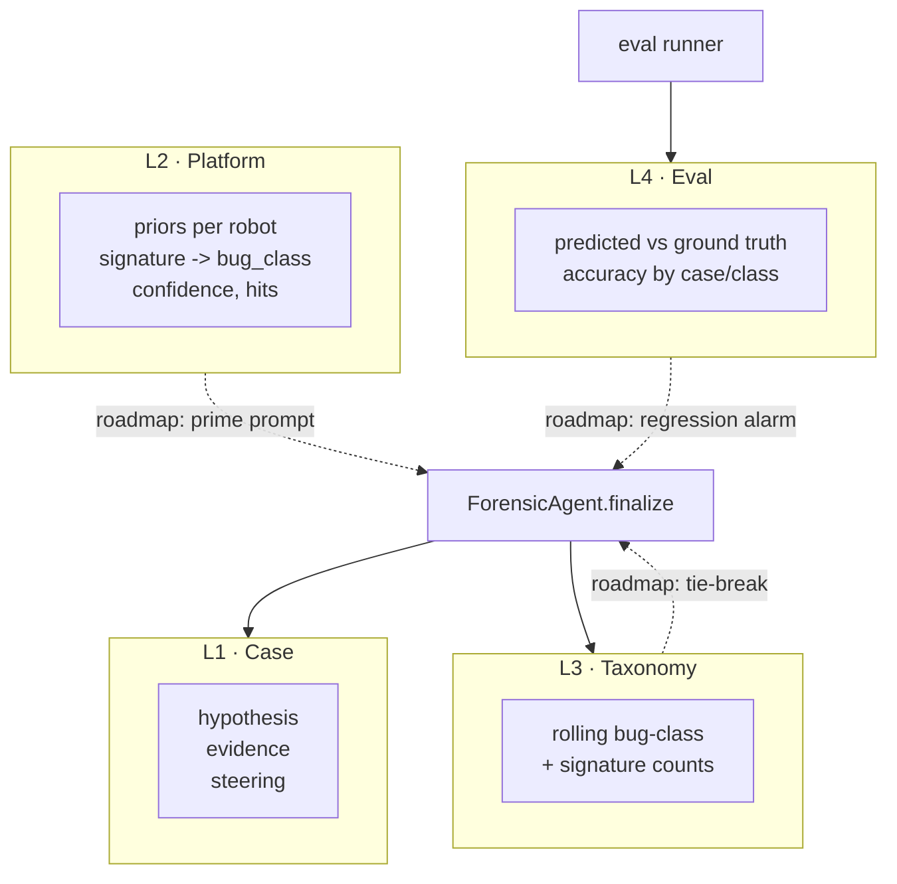
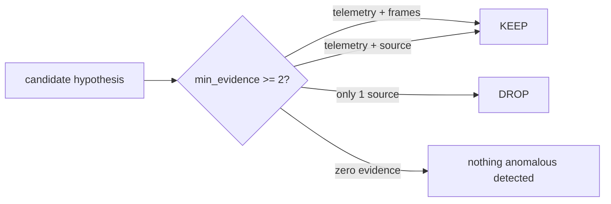
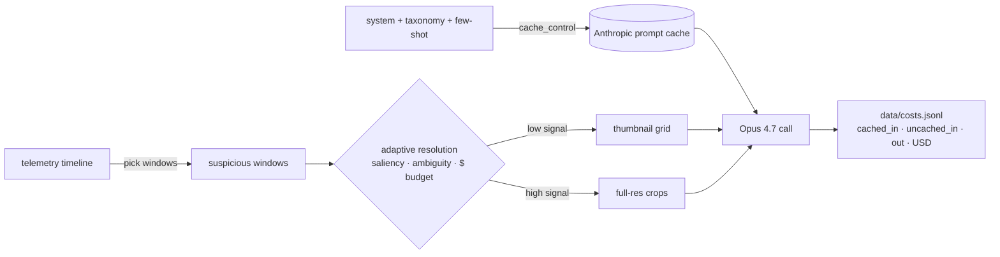

# Black Box

Forensic copilot for robots. Feed it a robot recording, get back a root-cause hypothesis, cross-modal evidence, and a scoped code patch.

> **Pitch placeholder.** When a robot crashes, the flight data recorder tells you *what* happened. Black Box tells you *why* — and hands you the diff.

Built with **Claude Opus 4.7** (vision + reasoning) + **Managed Agents** (long-horizon session replay).

## Docs
- [Build journal & strategy](https://gist.github.com/LucasErcolano/851c5e976c6aa364f69c9e6875544061) — narrative, novelty positioning, findings.
- [Team onboarding](docs/ONBOARDING.md) — scope, cadence, conventions.
- [Pitch](docs/PITCH.md) — one-liner, elevator, positioning one-liners.
- [Demo script](docs/DEMO_SCRIPT.md) — 3-min video beat sheet.
- [Risks](docs/RISKS.md) — risk register + stop-loss triggers.
- [Submission](docs/SUBMISSION.md) — deliverables checklist.
- [Testimonial](docs/TESTIMONIAL.md) — quote capture plan.
- [Flag-plant](docs/FLAG_PLANT.md) — X/LinkedIn thread copy.
- [Rehearsal](docs/REHEARSAL.md) — pitch timing, breath points, Q&A prep.

## Modes
- **Forensic post-mortem** — known-crash recording in, root cause + patch out.
- **Scenario mining** — clean recording in, 3–5 moments of interest out. Conservative: if nothing is found, the answer is "nothing anomalous detected."
- **Synthetic QA** — injected-bug recording in, hypothesis + self-eval vs ground truth out.

## Quickstart
```bash
python -m venv .venv && source .venv/bin/activate
pip install -e .
export ANTHROPIC_API_KEY=...    # or put in .env
python -m black_box.eval.runner --case-dir black-box-bench/cases
```

## System overview

Platform-agnostic by design: the analysis layer sees a normalized session (telemetry series, multi-view frames, source snapshots) regardless of the source robot or recording format.



## Analysis pipeline

The three modes share one agent loop. The prompt template and the grounding gate change per mode; the memory writes are uniform.



## Grounding gate (two exits)

Every hypothesis Claude emits runs through a deterministic post-filter before it reaches the PDF. The gate has two visible exits — refuse the operator narrative, or ship silence — and both are in-tree as demo assets.



- **Refutation exit** — [`demo_assets/grounding_gate/README.md`](demo_assets/grounding_gate/README.md) — sanfer_tunnel: operator said "tunnel caused the anomaly," telemetry said RTK was already degraded 43 min pre-tunnel. The gate promoted the refutation to a ranked hypothesis with its own confidence and patch_hint.
- **Silence exit** — [`demo_assets/grounding_gate/clean_recording/README.md`](demo_assets/grounding_gate/clean_recording/README.md) — clean recording fed in, model produced four plausible-but-under-evidenced hypotheses, gate dropped all four (one per rule) and shipped `"No anomaly detected with sufficient evidence to support a scoped fix."`

Rules live in `src/black_box/analysis/grounding.py :: GroundingThresholds`. Regenerate the silence-exit fixture with `python scripts/build_grounding_gate_demo.py`.

## Package layout



## Bug taxonomy — closed-set benchmark, open-world product

The benchmark scorer requires an **exact-match label** from a closed set of seven common failure modes. That closed set exists for *measurement*, not for *expression* — the product surface accepts any label the model produces and routes unknown labels to a neutral `other` bucket that still carries evidence and a scoped patch.



- **For the benchmark:** closed 7-class set. A hypothesis scores iff `predicted == ground_truth`.
- **For production traffic:** open-world labels allowed. `other` is a first-class bucket — the model still has to justify the claim with telemetry + frames, and the patch shape still has to be one of the scoped primitives (clamp / timeout / null check / gain adjust). New failure modes that recur get promoted into the taxonomy via the memory stack, not by changing the prompt.

## Memory stack — substrate today, self-improving loop on the roadmap

Black Box writes an append-only 4-layer JSONL store every run (no vector DB, no RAG). This is the **substrate** for self-improvement. The visible policy loop that consumes L2 priors + L3 frequencies + L4 accuracy to steer the agent between runs is not yet convincingly surfaced in the demo — it's the next piece.



**Shipped:** stack wiring, pydantic records, four independent stores, `MemoryStack.open()`, accuracy roll-ups by case and bug class, taxonomy counts on every finalize.

**Not yet shipped (roadmap):** the policy loop that reads L2 priors to bias the system prompt, uses L3 frequency as a tie-breaker on low-confidence hypotheses, and raises a regression alarm when L4 accuracy on a previously-solved case class drops below a threshold. Calling that "self-improving" would be overclaim until the loop is visible between runs.

## Grounding gate

The gate is the credibility floor: every hypothesis must anchor to at least two sources (telemetry window + frame evidence, or telemetry + source snippet). A clean recording returns `"nothing anomalous detected"` by construction — the gate is why Black Box doesn't hallucinate on calm bags.



## Adaptive resolution budgeter

Image resolution is not a fixed dial — it's a budget. The frame sampler chooses resolution per window based on:

- **Saliency** — is this a flagged telemetry spike or a quiet stretch?
- **Ambiguity** — did the last Claude call return low confidence or conflicting hypotheses?
- **Cost budget** — remaining per-case token budget against a $500 hackathon cap.



Default tier is a thumbnail grid across the selected views in one cross-view prompt — **never** one call per camera. The budgeter escalates to full-resolution crops only when the analysis step explicitly asks.

## Benchmark status

The benchmark lives in a sibling repo (`black-box-bench/`). Seven cases are present. Scoring requires exact match on `bug_class`.

| Path | Cases | Offline stub | Real Opus 4.7 | Notes |
|---|---|---|---|---|
| `run_tier3(use_claude=False)` | 7 | runs | — | deterministic plumbing check; does not call the model |
| `run_tier3(use_claude=True)` | 7 | — | one case confirmed (`pid_saturation_01` via smoke script) | others pending a budgeted bench pass |
| Tier-1 forensic batch runner | — | skeleton | skeleton | single-case path works end-to-end; batch CLI not yet wired |
| Tier-2 scenario-mining batch runner | — | skeleton | skeleton | agent loop exists; bench integration pending |
| Public-data path (`eval.public_data`) | — | stub | — | downloader + adapter mapping stubbed |

The published sample run in `black-box-bench/runs/sample/` is a hand-written reference, not model output.

## UI

Three states of the FastAPI + HTMX front-end running against synthetic fixtures. NTSB aesthetic — no gradients, monospace reasoning stream, explicit job IDs.

<p>
  <br />
  <em>Upload — pick a recording, pick a mode, hand off to the worker.</em>
</p>

<p>
  <br />
  <em>Progress — staged reasoning stream (ingesting / analyzing / synthesizing / reporting), HTMX polls <code>/status/{job_id}</code> once per second.</em>
</p>

<p>
  <br />
  <em>Report — complete state with root cause, download link, and the "View proposed fix" side-by-side diff.</em>
</p>

Reproduce: `python scripts/capture_screenshots.py` (requires `playwright` + `playwright install chromium`).

## UI status

`src/black_box/ui/` ships the upload → streaming-reasoning → side-by-side-diff UX. Behind the UI, the pipeline worker is currently the streaming **stub** (`_run_pipeline_stub` in `ui/app.py`) that walks through realistic stage chunks and emits a canned patch artifact for the diff viewer. The demo video uses this path.

The real worker (ingestion → `ForensicAgent` session → PDF render) runs today via `scripts/managed_agent_smoke.py`; wiring that into the UI background task is the next worker-level change.

## Implementation notes (current adapters)

- **Ingestion** — `rosbags` for ROS1+ROS2 bag files (pure Python, no ROS runtime). Other adapters plug in under `platforms/`.
- **First platform** — NAO6 (SoftBank Aldebaran) humanoid. `platforms/nao6/` includes an adapter, a synthetic fall fixture, and a platform-specific taxonomy that maps to the global bug-class set.
- **Synthesis** — emits telemetry + buggy controllers + text video prompts. Video generation (Wan 2.2 / Nano Banana Pro) is operator-driven on your own GPU; nothing is auto-installed.

## Architecture (modules)
- `ingestion/` — recording parser, frame sync, plot rendering.
- `analysis/` — Claude client with aggressive prompt caching, three prompt templates, pydantic schemas, `ForensicAgent` over Managed Agents SDK.
- `memory/` — 4-layer append-only JSONL stack (case / platform / taxonomy / eval).
- `platforms/` — robot-specific adapters + taxonomies.
- `synthesis/` — injected-bug recordings + text video prompts.
- `reporting/` — reportlab PDF (NTSB-style), unified diff + HTML side-by-side.
- `ui/` — FastAPI + HTMX progress polling (stub worker today; real wiring in progress).
- `eval/` — tier-3 runner + offline stub path; tier-1/tier-2 batch runners pending.

## License
MIT.
