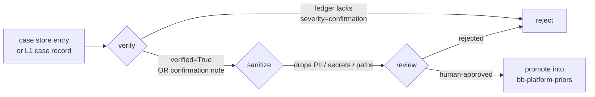

# Managed Agents memory — local L1-L4 vs native `/mnt/memory/`

Black Box runs two complementary memory layers on every forensic session.
This doc explains what they are, why both exist, and how a learning gets
promoted from per-case scratchpad to shared platform priors without ever
slipping past a human.

Cross-links: [`MEMORY_STACK.md`](MEMORY_STACK.md) for the local L1-L4
substrate; [`MEMORY_PROMOTION_PIPELINE.md`](MEMORY_PROMOTION_PIPELINE.md)
for the verify -> sanitize -> review -> promote flow (TODO: add when that
doc lands).

## Two layers, one pipeline

```mermaid
flowchart LR
    subgraph LOCAL[Local L1-L4 stack · audit-friendly JSONL]
        L1[L1 case<br/>hypotheses, steering]
        L2[L2 platform<br/>signature -> bug_class priors]
        L3[L3 taxonomy<br/>rolling counts]
        L4[L4 eval<br/>predicted vs ground truth]
    end

    subgraph NATIVE[Native /mnt/memory/ · Anthropic memory_stores]
        PRI[bb-platform-priors<br/>read-only · shared]
        CASE[bb-forensic-learnings-{case_key}<br/>read-write · case-isolated]
    end

    SESSION[ForensicAgent.open_session] --> L1
    SESSION --> CASE
    SESSION -. mounts read-only .-> PRI

    CASE -. verify -> sanitize -> review -> promote .-> PRI
    L1 -. severity=confirmation note .-> PRI
```

The local stack is the system of record (every line is committed JSONL,
greppable, replayable, no SDK dependency). The native mounts are the
in-context knowledge surface the model sees inside its sandbox at
`/mnt/memory/<slug>/...`.

## Layer comparison

| Aspect | Local L1-L4 (JSONL) | Native `/mnt/memory/` |
|---|---|---|
| Storage | append-only JSONL under `data/memory/` | Anthropic memory_stores (managed) |
| Scope | host filesystem; survives across processes | per-Anthropic-account; survives across sessions |
| Visibility to the model | only via prompt fragments we paste in | mounted as a real filesystem the agent can `ls`/`cat`/`write` |
| Audit | every line is committed; `git log` is the audit | versioned by Anthropic memory_versions API + redaction tools |
| Failure mode | file write fails -> raise | SDK call fails -> session continues without memory mount |
| Trust model | flat append-only; no overwrite | platform store enforces read-only at the FS layer |
| Use case | accuracy roll-ups, regression alarms, full replay | live retrieval inside the agent loop, no extra prompt tokens |

## Native mounts in detail

`ForensicAgent.open_session(...)` provisions two memory_stores per session:

### Platform store · `bb-platform-priors`

- Mode: **read-only**.
- Mount path: `/mnt/memory/bb-platform-priors/...`
- Lifetime: shared across every session for this account. Looked up by
  name; only created on first call, idempotent thereafter.
- Seed: bug taxonomy, anti-hypotheses (e.g. the `rtk_heading_break_01`
  prior that refutes "GPS fails in tunnel"), the safety contract.
- Source of truth: only human-verified knowledge ever lands here. Promotion
  is gated by the verification ledger (see Pipeline below).

### Case store · `bb-forensic-learnings-{case_key}`

- Mode: **read-write**.
- Mount path: `/mnt/memory/bb-forensic-learnings-{case_key}/...`
- Lifetime: a fresh store is created for every session. Case-isolated by
  construction, so one incident's scratchpad cannot leak into another.
- Use: the agent's working memory across long-horizon analysis (signal -> bug-class
  hypotheses, telemetry windows of interest, source-tree breadcrumbs).
- Trust: anything written here is **case-scoped and unverified**. Operator
  narratives and freshly-extracted observations live here; they do not get
  copied verbatim into the platform store.

Mount slugs follow Anthropic's deterministic name -> slug mapping; the SDK
returns the authoritative `mount_path` on the response. The agent's system
prompt explicitly tells it which slug is read-only.

## Verify -> sanitize -> review -> promote pipeline

The platform store is load-bearing. A bad prior (an unverified operator
narrative, an injected adversarial entry, a fabricated "bug class") would
poison every future session. The pipeline that gates promotion:



Implementation pointers:

- `black_box.memory.promote_verified_priors_to_managed_memory(...)` is the
  only sanctioned write path into the platform store. It refuses entries
  unless either:
  1. `verified=True` is set explicitly on the entry, or
  2. the entry references an `analysis_id` that has a
     `severity == "confirmation"` row in `data/memory/verification.jsonl`.
- Failure raises `UnverifiedMemoryPromotionError` BEFORE any SDK call —
  the platform store is never partially mutated by an unverified batch.
- The verification ledger (`memory/verification.py`) is append-only;
  there is no edit / delete API and the test suite asserts the public
  surface stays append-only.
- TODO(post-merge): cross-link the full pipeline doc at
  [`MEMORY_PROMOTION_PIPELINE.md`](MEMORY_PROMOTION_PIPELINE.md) once it
  lands. The verify and review steps live there; the sanitize step lives
  in `memory.sanitizer` (Agent 2 worktree).

## Mount paths summary

```
/mnt/memory/
  bb-platform-priors/                          # read-only, shared
    priors/
      bug_taxonomy.md
      safety_contract.md
      anti_hypotheses/
        rtk_heading_break_01.md
        ...
  bb-forensic-learnings-{case_key}/            # read-write, fresh per session
    notes/...
    signals/...
    hypotheses/...
```

The agent discovers what is there with `ls /mnt/memory/`; nothing is
hard-coded into the system prompt. The seed paths above are the contract
the platform-store seed code writes on first creation.

## Versioning + redaction

Anthropic exposes versioning + redaction APIs on memory_stores:

- `memory_versions` — every write produces an immutable version. Reads can
  pin a specific version to reproduce a past run. See the
  [Anthropic memory_versions API](https://docs.claude.com/en/api/managed-agents/memory-versions)
  reference (TODO: confirm exact path on next docs build).
- Redaction — secrets, PII, or rolled-back priors can be redacted at the
  store level without rewriting history. Redactions are themselves audited.

Black Box treats memory_versions as a recovery surface, not a routine
read path. The default `ForensicAgent.open_session` reads HEAD; replay
runs that need a frozen prior set should pass an explicit version pin.

## Why both layers exist

Different jobs:

- **Local L1-L4** is the **audit substrate**. Every claim in a report
  traces back to a JSONL line we own. CI grep, regression alarms, and
  the verification ledger all run against this layer; no Anthropic SDK
  required. It is the answer to "show me, in `git log`, where this
  conclusion came from."
- **Native `/mnt/memory/`** is the **in-context retrieval surface**. The
  agent reads it during the loop without us paying for prompt tokens to
  paste priors in every turn. Read-only at the FS layer means the model
  cannot accidentally overwrite a verified prior even if it tries.

Removing either layer is a regression:

- Drop local L1-L4 -> no replayable audit; no regression alarms; no
  evidence trace.
- Drop native `/mnt/memory/` -> every prior gets re-pasted into the
  prompt every turn (token waste + cache misses), and the read-only
  enforcement collapses to "trust the prompt".

## Operator demo

```bash
# Endpoint that surfaces the live mount config to the UI memory card.
curl -s http://127.0.0.1:8000/memory/native_status | jq .
```

Expected response (values come from `ForensicAgentConfig` defaults):

```json
{
  "platform_store": {
    "present": true,
    "name": "bb-platform-priors",
    "mode": "read_only"
  },
  "case_store_template": "bb-forensic-learnings-{case_key}",
  "gate": "verification_ledger"
}
```

The UI memory card on `/` is server-side rendered from this same payload
so the card cannot drift from the agent provisioning code in
`src/black_box/analysis/managed_agent.py`.
