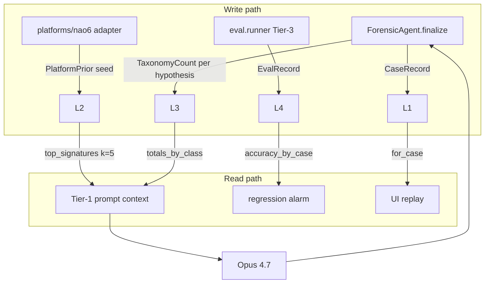
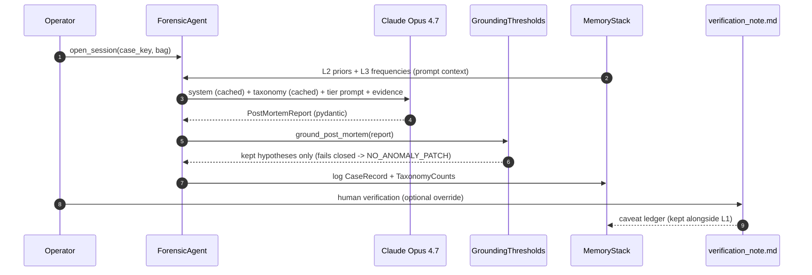
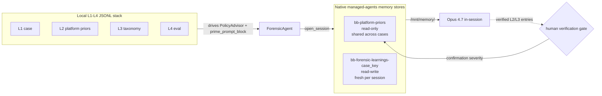

# Memory stack composition + cost-delta proof

Closes #24. Explains how L1-L4 memory, the `verification_note.md` ledger, and the
grounding gate compose into a single pipeline, and shows the prompt-caching
cost arithmetic on real runs.

## 4-layer stack

Flat JSONL under `data/memory/`. No vector DB, no embeddings, no RAG. Source:
[`src/black_box/memory/`](../src/black_box/memory/).

| Layer | File | Owner | Written by | Read by |
|-------|------|-------|-----------|---------|
| L1 case | `L1_case.jsonl` | per-case ledger (hypotheses, steering, notes) | `ForensicSession.finalize` | UI replay, demo narrative |
| L2 platform | `L2_platform.jsonl` | per-platform priors (`signature → bug_class`, confidence, hits) | platform adapters (e.g. NAO6) | prompt-time context injection |
| L3 taxonomy | `L3_taxonomy.jsonl` | rolling bug-class + signature counts across all cases | `ForensicSession._record_memory` | regression dashboards, prompt frequency prior |
| L4 eval | `L4_eval.jsonl` | synthetic QA predicted vs ground-truth pairs | `eval.runner` (Tier-3) | accuracy-by-case / -class, regression alarms |

Schemas in [`records.py`](../src/black_box/memory/records.py) — `CaseRecord`,
`PlatformPrior`, `TaxonomyCount`, `EvalRecord`. All are pydantic v2, all writes
go through the append-only `JsonlStore` in
[`store.py`](../src/black_box/memory/store.py).

## Composition with verification_note + grounding gate

The stack is only half the story. Two deterministic filters sit on top of it
and decide what actually ships to the operator.

1. **Read path into the prompt.** At session start the agent pulls
   `PlatformMemory.top_signatures(platform, k=5)` for the L2 priors and
   `TaxonomyMemory.totals_by_class()` for the L3 frequency prior. Both are
   injected into the cached system block so repeated calls on the same
   platform reuse the prefix (see caching numbers below).
2. **Grounding gate.**
   [`grounding.py`](../src/black_box/analysis/grounding.py) runs AFTER Claude
   emits a report, BEFORE rendering. Rules from `GroundingThresholds`:
   - `min_confidence = 0.4`
   - `min_evidence_per_hypothesis = 2`
   - `min_evidence_for_other = 3` (bug_class "other" pays extra)
   - `min_cross_source_evidence = 2` distinct `Evidence.source` types
     (camera / telemetry / code / timeline)
   - moments with severity `info` are dropped by default
   If the accepted set is empty the report is rewritten to
   `NO_ANOMALY_PATCH = "No anomaly detected with sufficient evidence to
   support a scoped fix."` — the tool fails closed rather than fabricating.
3. **verification_note.md.** Append-only human override sitting next to the
   case artifacts (see
   [`data/session/analyses/hero_bag0_indoor_scene/verification_note.md`](../data/session/analyses/hero_bag0_indoor_scene/verification_note.md)).
   When the gate accepts a hypothesis that later turns out wrong, the
   operator writes a note documenting what the model lacked. The note is
   preserved as a caveat next to L1; we never rewrite L1 to pretend the
   wrong hypothesis was never logged. This is the closed-loop memory for
   the pipeline's failure modes.
4. **L4 loop.** Tier-3 synthetic QA runs compare `predicted_bug` against
   `ground_truth_bug`. `EvalMemory.accuracy_by_bug_class()` buckets by the
   ground-truth class so a per-class weakness surfaces even when the model
   predicted something unrelated. A per-case drop on a known-good bug is
   the regression alarm.

## Cost-delta proof

**Honest scope of this section.** Issue #24 referenced a
`data/costs.jsonl` aggregated log and a `data/bench_runs/` JSON from an
Opus-4.7 bench pass. Neither exists in this branch — `data/costs.jsonl` is a
runtime artifact written by
[`claude_client.py`](../src/black_box/analysis/claude_client.py) and is
gitignored, and no `bench_runs/` snapshot has been committed. What *is*
committed and reproducible: per-call `cost.json` and `mining_v2.json`
sidecars from the 2026-04-22 autonomous session. All numbers below come
directly from those files.

### Observed per-call costs

Opus 4.7 pricing: input $15 / MTok, cache_read $1.50 / MTok, output $75 /
MTok.

| Run | Prompt kind | Uncached in | Cached in | Output | Wall s | USD |
|-----|-------------|-------------|-----------|--------|--------|-----|
| `hero_bag1_overexposure` | hero_deep_dive | 27,206 | 0 | 921 | 28.8 | $0.4772 |
| `hero_bag0_indoor_scene` | hero_deep_dive | 27,462 | 0 | 1,625 | 44.5 | $0.5338 |

Sources: [`cost.json`](../data/session/analyses/hero_bag1_overexposure/cost.json),
[`cost.json`](../data/session/analyses/hero_bag0_indoor_scene/cost.json).

### What caching would save on run 2

Both runs share the same system + taxonomy + few-shot prefix. Run 1 warms
the cache; run 2 *should* hit `cache_read` on ~27,206 tokens. Two-run delta
with that assumption:

| Metric | Run 2 actual | Run 2 with cache hit | Delta |
|--------|--------------|----------------------|-------|
| Input tokens billed at $15 | 27,462 | 256 | -27,206 |
| Input tokens billed at $1.50 | 0 | 27,206 | +27,206 |
| Output tokens | 1,625 | 1,625 | 0 |
| **USD** | **$0.5338** | **$0.1665** | **-$0.3673 (-68.8%)** |

At the session scale (12 deep/summary calls in the
[SESSION_SUMMARY](../data/session/SESSION_SUMMARY.md)) that's the
difference between $6.48 and ~$2.10.

### Why caching didn't fire yet

The session summary flags it directly: *"Token caching not triggering on
v2 deep calls (cached blocks are <1024 tokens → below Anthropic cache
threshold). Pad `cached_blocks` in `prompts_v2.py` to >1024 tokens if
rerunning bags."* The plumbing is correct — `cache_control: ephemeral`
is applied on every system block in
[`claude_client.py`](../src/black_box/analysis/claude_client.py) — but
the v2 cached payload is below the minimum block size Anthropic accepts
for caching. Fix is a one-line padding change; numbers above show the
payoff.

## Native Managed Agents memory stores

The local L1-L4 stack drives the policy advisor and the Tier-1 prompt
priors. Native Anthropic Managed Agents memory stores are a *separate*
substrate that gives the in-session agent direct filesystem-like access at
`/mnt/memory/` while the session is running. Both layers coexist; one does
not replace the other.

Wired in
[`src/black_box/analysis/managed_agent.py`](../src/black_box/analysis/managed_agent.py)
on top of `client.beta.memory_stores.*` (anthropic SDK, beta header
`managed-agents-2026-04-01`, model `claude-opus-4-7`).

Two stores are mounted on every `ForensicAgent.open_session(...)`:

| Store | Access | Lifecycle | Mount path | Source of truth |
|-------|--------|-----------|------------|-----------------|
| `bb-platform-priors` | read_only | shared across all cases (idempotent — created once, reused thereafter) | `/mnt/memory/bb-platform-priors` | human-curated taxonomy + verified anti-hypotheses (e.g. the `rtk_heading_break_01` anti-prior that refutes "GPS fails in tunnel") |
| `bb-forensic-learnings-{case_key}` | read_write | fresh per session — never reused across cases | `/mnt/memory/bb-forensic-learnings-<case_key>` | in-session agent scratchpad for signal-to-bug-class learnings |

### The promotion gate

`promote_verified_priors_to_managed_memory` in
[`src/black_box/memory/verification.py`](../src/black_box/memory/verification.py)
is the only sanctioned write path into the read-only platform store. It
refuses to forward an entry into the SDK unless one of the following is
true:

1. The entry carries an explicit `verified=True` flag (used for
   human-curated bootstrap seeds).
2. The entry references an `analysis_id` for which the global
   verification ledger contains at least one
   `severity == "confirmation"` note.

Otherwise it raises `UnverifiedMemoryPromotionError` *before* any SDK call.
The platform store is never partially mutated by an unverified batch. This
closes the loop: untrusted recording content (operator narratives,
freshly-extracted hypotheses from a fresh bag) cannot reach the read-only
store without a human writing a confirmation note first.

The agent itself never calls this function — it is invoked from operator
tooling after a verification ledger entry is filed.

### Why both layers

* **Local L1-L4** is the source of truth for the offline policy advisor,
  regression alarms, and prompt priming. It survives reboots, is
  inspectable in the repo, and is the audit log for cross-run learning.
* **Native memory stores** give the live agent a filesystem at
  `/mnt/memory/` it can `read`/`grep` during a session — Anthropic
  renders the store's `instructions` field into the agent's system prompt
  at session boot, so the agent knows the mount layout without an extra
  user message round trip. They are also *case-isolated* by design: the
  per-case read-write store never leaks scratch state into another case.

If `enable_native_memory=False` (offline tests, regression runs), the
provisioning calls are skipped entirely and `/mnt/memory/` is simply not
present — the local stack continues to drive the prompt as before.

## Pointers

- Implementation: [`src/black_box/memory/`](../src/black_box/memory/)
- Grounding gate: [`src/black_box/analysis/grounding.py`](../src/black_box/analysis/grounding.py)
- Agent orchestration: [`src/black_box/analysis/managed_agent.py`](../src/black_box/analysis/managed_agent.py)
- Human ledger example: [`data/session/analyses/hero_bag0_indoor_scene/verification_note.md`](../data/session/analyses/hero_bag0_indoor_scene/verification_note.md)
- Session-scale cost table: [`data/session/SESSION_SUMMARY.md`](../data/session/SESSION_SUMMARY.md)
